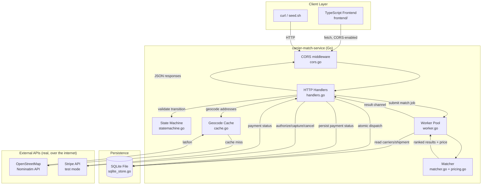
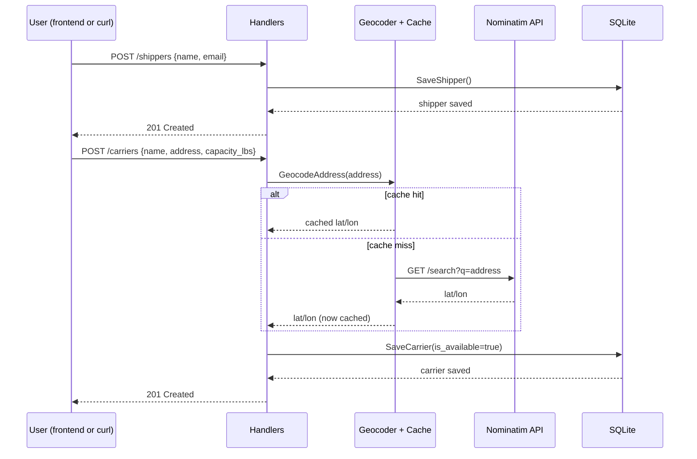
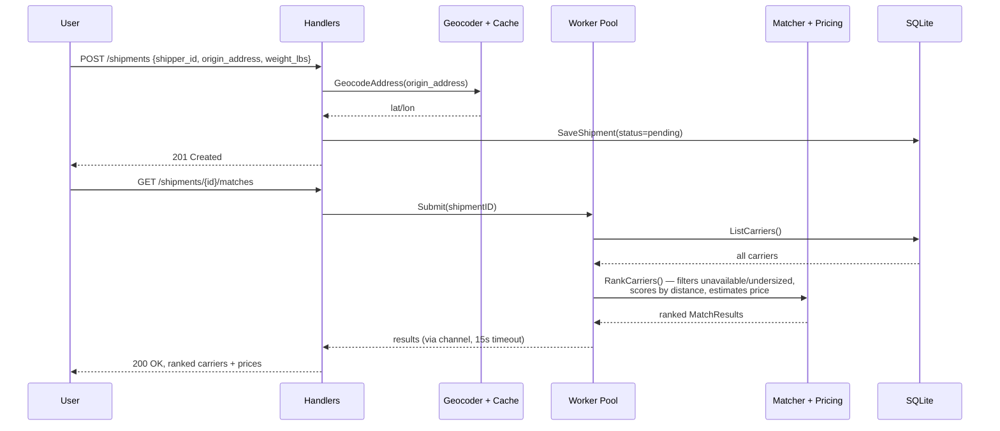
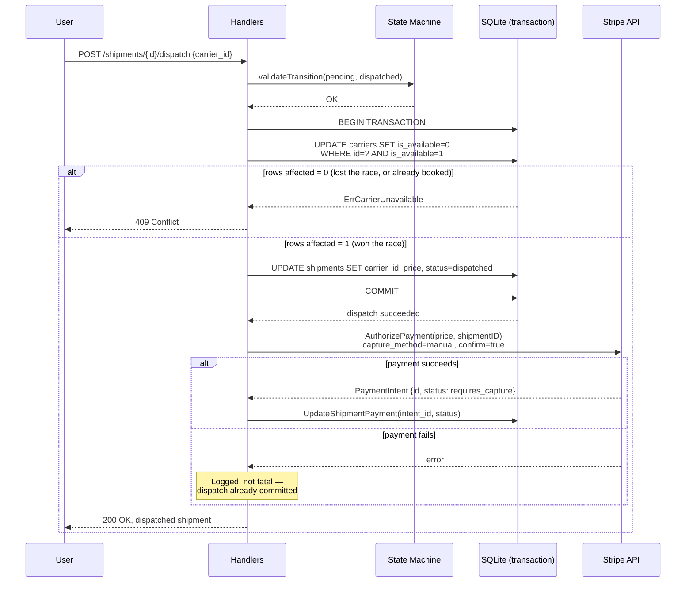
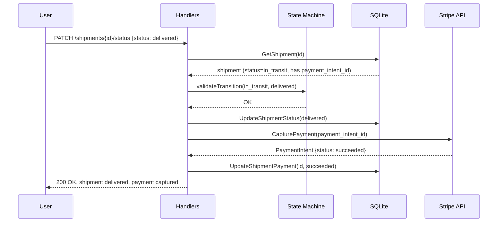
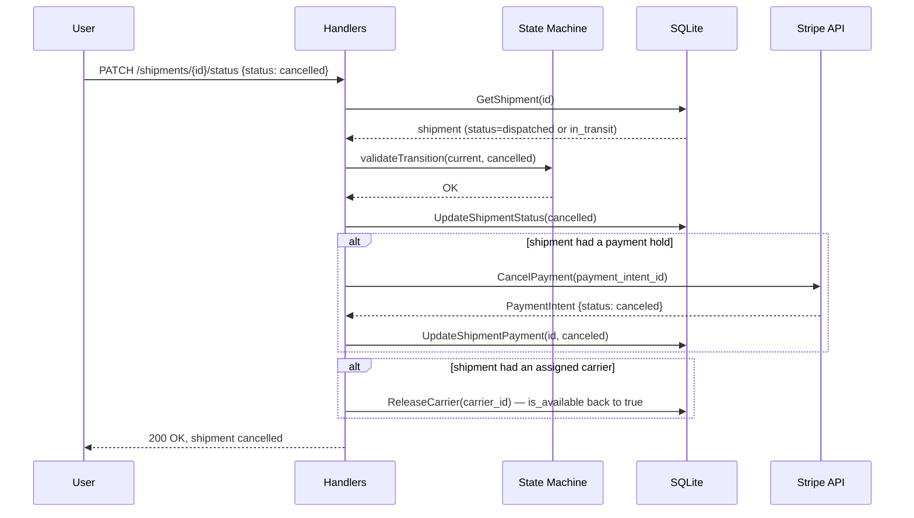
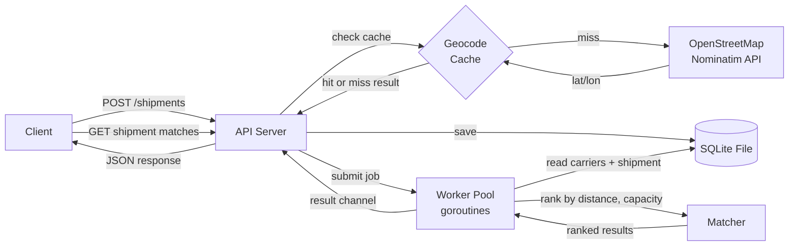
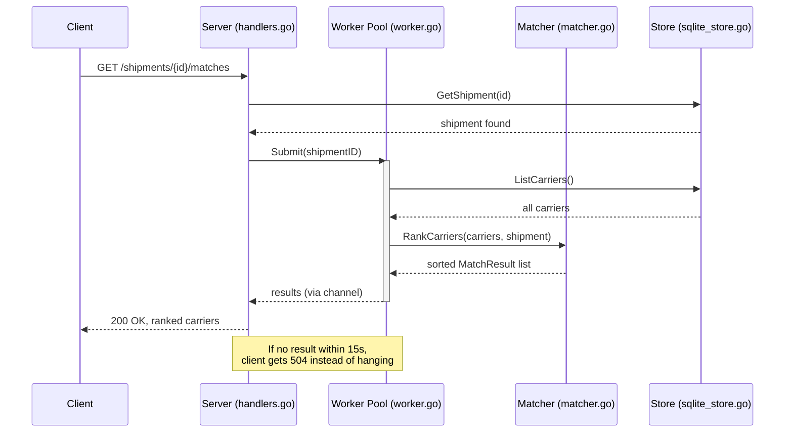
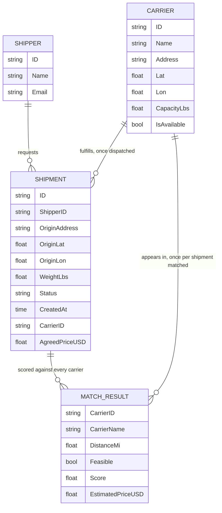

A small Go backend service that matches and scores freight carriers against
shipments. Built as a hands-on Go project, shaped around a real problem a
freight/logistics marketplace backend has to solve: given a shipment, which
of your available carriers can actually take it, and which is the best fit?

## What it does

1. You register a **shipper** (the business requesting a shipment) and
   **carriers** (name, address, how much weight they can carry).
2. You register a **shipment** for that shipper (pickup address, weight).
3. You ask for **matches** — the service ranks every carrier that can
   physically carry the shipment, closest and best-fit first, each with an
   estimated price.
4. You **dispatch** the shipment to a specific carrier — this is the real
   "accept the load" step: the carrier is atomically marked booked (so two
   concurrent dispatch attempts on the same carrier can't both succeed), and
   a price is agreed.
5. You **track** the shipment through pickup and delivery — status moves
   through an explicit state machine (`dispatched → in_transit → delivered`,
   or `→ cancelled`), rejecting any transition that isn't a real next step.

Addresses are converted to coordinates via a real call to a public geocoding
API, and matching happens asynchronously through a worker pool rather than
inline on the request.

## Full system architecture

Every component in the system and how they connect — the SQLite file, the
worker pool, and both external APIs (Nominatim, Stripe):



## User flows for every new feature

Each of the flows below is a real, separate path through the system —
drawn individually rather than folded into one diagram, since dispatch,
delivery, and cancellation each trigger genuinely different behavior
(especially around payment).

### 1. Registering a shipper and carriers



### 2. Creating a shipment and getting ranked matches



### 3. Dispatch — booking a carrier and authorizing payment

The flow where correctness actually matters: two concurrent dispatch
requests for the same carrier must not both succeed.



### 4. Delivery — capturing the payment hold



### 5. Cancellation — releasing the payment hold



## How a request flows through the service



**Why matching is async instead of just a function call:** the worker pool
(`worker.go`) demonstrates the same shape a real dispatch system uses —
submit a job, process it off the request path, get the result back through a
channel. It's overkill for how cheap this particular scoring math is, and
that's on purpose: the goal was to build the *pattern* correctly, not to
solve a performance problem that doesn't exist yet at this scale.

## What happens when you ask for matches

This sequence diagram shows one `GET /shipments/{id}/matches` call, start to
finish, including where it would time out:



## Data model



`MatchResult` isn't stored — it's computed fresh on every match request from
the current `Carrier` and `Shipment` records, which is why it's drawn here as
a relationship rather than a table with foreign keys.

## Additional Actors : shipper, dispatch, pricing, tracking, payment

Earlier versions of this project only modeled the matching step — ranking
carriers, with nothing that actually booked one. Five real gaps got closed:

**Shipper.** Previously a shipment existed with no owner. `Shipper` is now a
real entity, and every shipment requires a `shipper_id` (`handlers.go`'s
`handleCreateShipment` rejects a shipment with none).

**Dispatch — the actual "accept the load" step.** `POST
/shipments/{id}/dispatch` is what turns a ranked match into a real booking.
The important part is *how* double-booking is prevented — see
`sqlite_store.go`'s `Dispatch()` method, which uses a conditional `UPDATE
carriers SET is_available = 0 WHERE id = ? AND is_available = 1` inside a
transaction. If two dispatch requests race for the same carrier, only one
`UPDATE` can affect a row; the loser gets `ErrCarrierUnavailable` back
(→ HTTP 409), not a silent double-booking.

**Pricing.** `pricing.go` computes a price (`estimatePriceUSD`) from a flat
base fee plus distance and weight components. **This is explicitly a
placeholder formula, not real freight market rates** — said plainly in the
file itself, since faking sophistication here would be worse than being
direct about it. What's real is the *mechanism*: a price is computed, shown
before dispatch, and recorded on the shipment at dispatch time.

**Payment.** A real Stripe integration — see the dedicated section below for
the full explanation. Short version: dispatch authorizes a hold, delivery
captures it, cancellation releases it, all in Stripe's free test mode, no
real money ever at risk.

**Tracking / status.** `statemachine.go` replaces what used to be a bare
status string with an explicit set of allowed transitions
(`pending → dispatched → in_transit → delivered`, or `→ cancelled`/`→
no_match`). `PATCH /shipments/{id}/status` rejects anything not on that
list with a 409 — a shipment can no longer silently jump from `delivered`
back to `pending`.

## Payment: real Stripe integration, test mode, genuinely free

`payment.go` calls Stripe's REST API directly with `net/http` — **not** the
official `stripe-go` SDK, which would add a large dependency for what's
underneath a handful of form-encoded POST requests. This keeps the
project's total external dependency count at exactly one
(`modernc.org/sqlite`), same philosophy as `geocode.go` calling Nominatim
directly instead of pulling in a geocoding library.

**The flow, tied to real events:**
- **Dispatch** → `AuthorizePayment()` creates and confirms a Stripe
  `PaymentIntent` with `capture_method=manual` — this places a *hold*, like
  a hotel or rental car deposit, without charging anything yet.
- **Delivered** → `CapturePayment()` completes the charge (in test mode,
  no real money — see below).
- **Cancelled** (after being dispatched) → `CancelPayment()` releases the
  hold instead of charging it.


**External APIs:**
- Create a free Stripe account (no card required) and grab a **test** secret
  key (starts with `sk_test_`) from
  [dashboard.stripe.com/test/apikeys](https://dashboard.stripe.com/test/apikeys)
- `payment.go` uses Stripe's own published test payment method token
  (`pm_card_visa`) — documented publicly at
  [stripe.com/docs/testing](https://stripe.com/docs/testing) — so the whole
  authorize → capture flow runs via plain server-to-server API calls, with
  no frontend card-entry form (Stripe Elements/Checkout) needed
- Test mode simply **cannot** move real money — there's no live payment
  method attached, no way to accidentally charge anything

**Enable it:**
```bash
export STRIPE_SECRET_KEY=sk_test_your_key_here
go run .
```
Without that env var set, the server still runs fine — dispatch and
delivery just skip the payment steps (logged, not fatal). `main.go` checks
for the key and logs which mode it's in on startup.

**Limitation:** payment authorization is a separate API call from
`Dispatch()`, not inside the same database transaction. If the Stripe call
fails after a successful dispatch, the shipment stays validly dispatched
(carrier correctly booked) with no payment hold recorded — logged as an
error, not silently lost, but also not automatically retried. A stricter
design might roll back the dispatch entirely on payment failure; this
project treats "carrier booked, payment needs a retry" as more realistic
than un-booking a carrier over a transient API hiccup.

## Cache

Nominatim's usage policy caps requests at roughly 1/second per client. The
same address gets geocoded more than once in normal use of this app — a
carrier's address doesn't change between requests, and you might look up
matches for the same shipment repeatedly. Re-calling the geocoding API every
single time is both wasteful and risks tripping that rate limit. `cache.go`
is a small, mutex-guarded in-memory map keyed on the raw address string,
checked before any outbound call. `/health` exposes hit/miss counts, so it's
actually observable whether the cache is doing anything, rather than just
assumed.

This stays in-memory rather than Redis on purpose: the honest reason to add
Redis here would be sharing the cache across *multiple running instances* of
this service, which this project doesn't have — not raw lookup speed, which
an in-process map already handles fine at this scale.

## Frontend

`frontend/` is a small, dependency-free TypeScript app — no React, no npm
packages, just the TypeScript compiler and native browser APIs (`fetch`,
DOM). Three forms: register a carrier, register a shipment, then look up
ranked matches for that shipment.

**Why no framework:** the same reasoning as the backend's zero-dependency
approach — this app is small enough that plain TypeScript + DOM APIs cover
everything it needs, and it means the whole frontend can be verified with
just `tsc`, no `npm install` required (this project's sandbox couldn't reach
the npm registry at all, which is exactly the kind of environment this
approach survives and a React setup wouldn't).

**Types are hand-kept in sync with the Go backend's JSON structs**
(`frontend/src/types.ts` mirrors `models.go`). That's a real maintenance
cost worth naming honestly — if a field is renamed in the Go struct, this
file has to be updated by hand, nothing catches the drift automatically. A
codegen step (e.g. generating TS types from an OpenAPI spec) would remove
that risk; not done here to keep the project dependency-free.

Run it:
```bash
cd frontend
tsc                          # compiles src/*.ts -> dist/*.js
python3 -m http.server 5173  # serve the folder (no npm needed)
# open http://localhost:5173 — with the Go backend running on :8080 alongside it
```

The Go backend needs to be running (`go run .` from the project root) for
the frontend to have anything to talk to — `cors.go` was added specifically
so the browser (frontend on :5173) is allowed to call the API (on :8080),
since those count as different origins.

## Endpoints

| Method | Path | Body |
|---|---|---|
| `POST` | `/shippers` | `{"name": "...", "email": "..."}` |
| `POST` | `/carriers` | `{"name": "...", "address": "...", "capacity_lbs": 40000}` |
| `GET` | `/carriers` | — |
| `POST` | `/shipments` | `{"shipper_id": "...", "origin_address": "...", "weight_lbs": 12000}` |
| `GET` | `/shipments/{id}/matches` | — |
| `POST` | `/shipments/{id}/dispatch` | `{"carrier_id": "...", "price_usd": 250.00}` (`price_usd` optional — computed if omitted) |
| `PATCH` | `/shipments/{id}/status` | `{"status": "in_transit"}` (validated against `statemachine.go`) |
| `GET` | `/health` | — |

## Running it

Requires Go 1.22+ (uses the standard library's built-in method+path routing —
no third-party router needed).

```bash
go mod tidy    # fetches the SQLite driver — needs network access
go build ./...

# optional — enables real (test-mode, free) Stripe payment authorization/capture.
# Without this set, the server still runs fine; payment steps are just skipped.
export STRIPE_SECRET_KEY=sk_test_your_key_here

go run .
```

## Storage: SQLite (real, persistent)

Data is stored in a real SQLite file (`carrier_match.db`, created
automatically on first run) — not in memory. It survives restarts, unlike
the earlier in-memory version of this project. `sqlite_store.go` implements
the same `Store` interface `MemStore` (still in `store.go`) does, so nothing
else in the app had to change.

**Prove to yourself it's actually persistent**, rather than taking it on faith:
```bash
go run .                          # terminal 1 — starts the server
./seed.sh                         # terminal 2 — adds sample carriers
# now Ctrl+C the server in terminal 1, then:
go run .                          # start it again
curl localhost:8080/carriers      # the carriers are still there
```

If you want a truly disposable/in-memory run for quick testing (no file left
behind), that's what `MemStore` in `store.go` is still there for — swapping
`NewSQLiteStore(dbPath)` for `NewMemStore()` in `main.go` reverts to it.

### Quick start with sample data

```bash
./seed.sh
```

This registers 5 sample carriers across different cities, creates one
sample shipment, and prints the ranked matches — everything you need to see
the whole pipeline working in one command. Requires the server already
running in another terminal (`go run .`). Re-run it any time after a
restart, since the in-memory store won't have survived.

### Manual requests

```bash
curl -X POST localhost:8080/carriers \
  -d '{"name":"Acme Freight","address":"Chicago, IL","capacity_lbs":40000}'

curl -X POST localhost:8080/shipments \
  -d '{"origin_address":"Denver, CO","weight_lbs":12000}'

# use the "id" from the response above:
curl localhost:8080/shipments/<id>/matches
```

Tests are pure logic and don't touch the network (geocoding is deliberately
not exercised by tests, so `go test` never depends on Nominatim being up or
rate-limits you):

```bash
go test ./...
```
