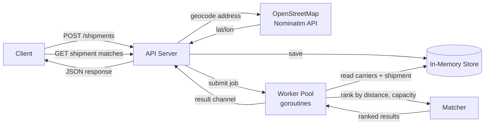
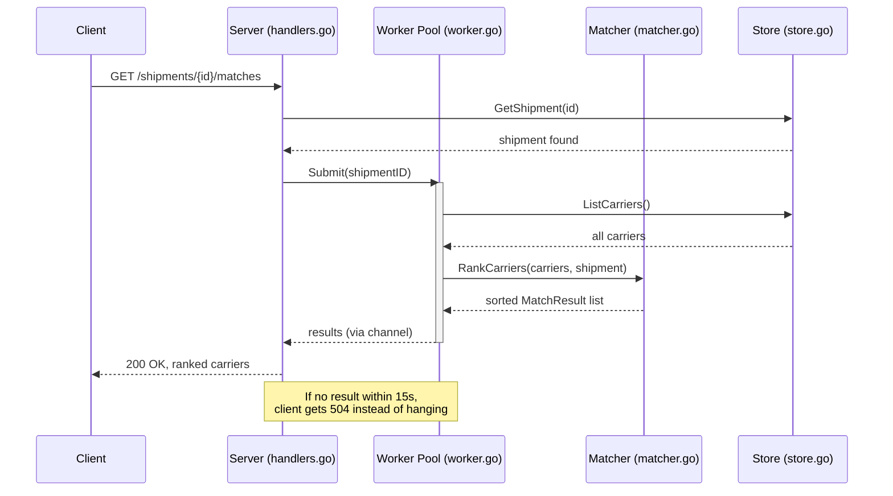
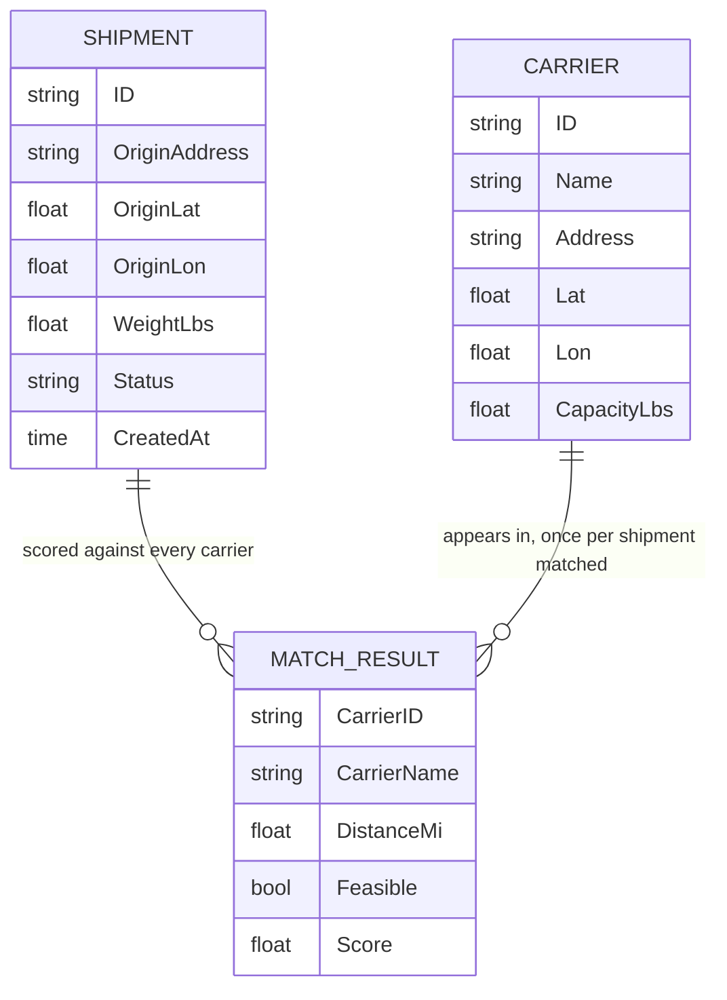

# carrier-match-service

A Go backend service that matches and scores freight carriers against
shipments. Built as a hands-on Go project, shaped around a real problem a
freight/logistics marketplace backend has to solve: given a shipment, which
of your available carriers can actually take it, and which is the best fit?

## What it does

1. You register carriers (name, address, how much weight they can carry).
2. You register a shipment (pickup address, weight).
3. You ask for matches — the service ranks every carrier that can physically
   carry the shipment, closest and best-fit first.

Addresses are converted to coordinates via a real call to a public geocoding
API, and matching happens asynchronously through a worker pool rather than
inline on the request.

## Why go was Useful

- **Concurrency without the usual overhead.** The whole point of `worker.go`
  is a pool of workers processing match jobs off the request path. In Java,
  that means threads (heavyweight, OS-scheduled — though virtual threads in
  newer JDKs close this gap) or a reactive framework's added complexity. In
  Python, the GIL means "concurrent" often isn't actually parallel for
  CPU-bound work, and `asyncio` requires the whole call stack to be
  async-aware. Go's goroutines are cheap enough to spin up thousands of them
  without thinking about it, and channels give a genuinely simple way for
  the worker pool to hand results back — no thread pool tuning, no
  `async`/`await` coloring problem.
- **A single static binary, nothing else installed.** `go build` produces
  one executable. No JVM to provision, no `node_modules`, no Python
  interpreter/virtualenv version drift. For a small backend service meant to
  run in a container, that's a genuinely simpler deployment story than any
  of the three languages I use day to day.
- **Static typing that's stricter than JavaScript, lighter-weight than Java.**
  Compile-time type checking without Java's verbosity (no interfaces-for-
  everything ceremony) — closer to how Python *feels* to write, but with the
  bugs Python only catches at runtime caught before the binary even builds.
- **Standard library that doesn't need a framework.** `net/http` alone was
  enough to build a real REST API here — no Express, no Flask/FastAPI, no
  Spring Boot. Worth knowing what a language's stdlib can do unassisted.

## How a request flows through the service



**Why matching is async instead of just a function call:** the worker pool
(`worker.go`) demonstrates the same shape a real dispatch system uses —
submit a job, process it off the request path, get the result back through a
channel. It's overkill for how cheap this particular scoring math is, and
that's on purpose: the goal was to build the *pattern* correctly, not to
solve a performance problem that doesn't exist yet at this scale.

## What happens when you ask for matches

This sequence diagram shows one `GET /shipments/{id}/matches` call, start to
finish, including where it would time out:



## Data model



`MatchResult` isn't stored — it's computed fresh on every match request from
the current `Carrier` and `Shipment` records, which is why it's drawn here as
a relationship rather than a table with foreign keys.

## What's actually real vs. simplified

Worth knowing before relying on this for anything beyond a demo:

| Piece | What's here | What a production version would need |
|---|---|---|
| Geocoding | Real call to OpenStreetMap's Nominatim API, with an in-memory cache in front of it (`cache.go`) so repeat lookups don't re-hit the rate-limited API | A shared cache (Redis) if this ran as multiple instances — a single process's in-memory cache doesn't help a second instance |
| Storage | In-memory map, one `Store` interface (`store.go`) | Postgres, behind the same interface — the seam is already there |
| Async matching | Real goroutines + channels (`worker.go`) | A durable queue (Kafka/Redis) — jobs here are lost on restart |
| Scoring | Distance + capacity only (`matcher.go`) | Would also weigh price, reliability, appointment availability |
| Frontend | Real, type-checked TypeScript (`frontend/`) — no framework, compiled with `tsc` | Works locally; no build pipeline/bundler/deployment story beyond that |
| Auth | None | JWT or API keys before this is exposed to anyone but you |
| IDs | Random 16-byte hex, not RFC 4122 UUIDs (`id.go`) | Swap in `github.com/google/uuid` if strict UUID format matters |

## Why there's a cache, specifically

Nominatim's usage policy caps requests at roughly 1/second per client. The
same address gets geocoded more than once in normal use of this app — a
carrier's address doesn't change between requests, and you might look up
matches for the same shipment repeatedly. Re-calling the geocoding API every
single time is both wasteful and risks tripping that rate limit. `cache.go`
is a small, mutex-guarded in-memory map keyed on the raw address string,
checked before any outbound call. `/health` exposes hit/miss counts, so it's
actually observable whether the cache is doing anything, rather than just
assumed.

This stays in-memory rather than Redis on purpose: the honest reason to add
Redis here would be sharing the cache across *multiple running instances* of
this service, which this project doesn't have — not raw lookup speed, which
an in-process map already handles fine at this scale.

## Frontend

`frontend/` is a small, dependency-free TypeScript app — no React, no npm
packages, just the TypeScript compiler and native browser APIs (`fetch`,
DOM). Three forms: register a carrier, register a shipment, then look up
ranked matches for that shipment.

**Why no framework:** the same reasoning as the backend's zero-dependency
approach — this app is small enough that plain TypeScript + DOM APIs cover
everything it needs, and it means the whole frontend can be verified with
just `tsc`, no `npm install` required (this project's sandbox couldn't reach
the npm registry at all, which is exactly the kind of environment this
approach survives and a React setup wouldn't).

**Types are hand-kept in sync with the Go backend's JSON structs**
(`frontend/src/types.ts` mirrors `models.go`). That's a real maintenance
cost worth naming honestly — if a field is renamed in the Go struct, this
file has to be updated by hand, nothing catches the drift automatically. A
codegen step (e.g. generating TS types from an OpenAPI spec) would remove
that risk; not done here to keep the project dependency-free.

Run it:
```bash
cd frontend
tsc                          # compiles src/*.ts -> dist/*.js
python3 -m http.server 5173  # serve the folder (no npm needed)
# open http://localhost:5173 — with the Go backend running on :8080 alongside it
```

The Go backend needs to be running (`go run .` from the project root) for
the frontend to have anything to talk to — `cors.go` was added specifically
so the browser (frontend on :5173) is allowed to call the API (on :8080),
since those count as different origins.

## Endpoints

| Method | Path | Body |
|---|---|---|
| `POST` | `/carriers` | `{"name": "...", "address": "...", "capacity_lbs": 40000}` |
| `GET` | `/carriers` | — |
| `POST` | `/shipments` | `{"origin_address": "...", "weight_lbs": 12000}` |
| `GET` | `/shipments/{id}/matches` | — |
| `GET` | `/health` | — |

## Running it

Requires Go 1.22+ (uses the standard library's built-in method+path routing —
no third-party router needed).

```bash
go build ./...
go run .
```

```bash
curl -X POST localhost:8080/carriers \
  -d '{"name":"Acme Freight","address":"Chicago, IL","capacity_lbs":40000}'

curl -X POST localhost:8080/shipments \
  -d '{"origin_address":"Denver, CO","weight_lbs":12000}'

# use the "id" from the response above:
curl localhost:8080/shipments/<id>/matches
```

Tests are pure logic and don't touch the network (geocoding is deliberately
not exercised by tests, so `go test` never depends on Nominatim being up or
rate-limits you):

```bash
go test ./...
```

